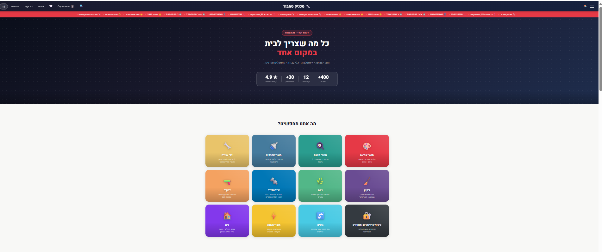
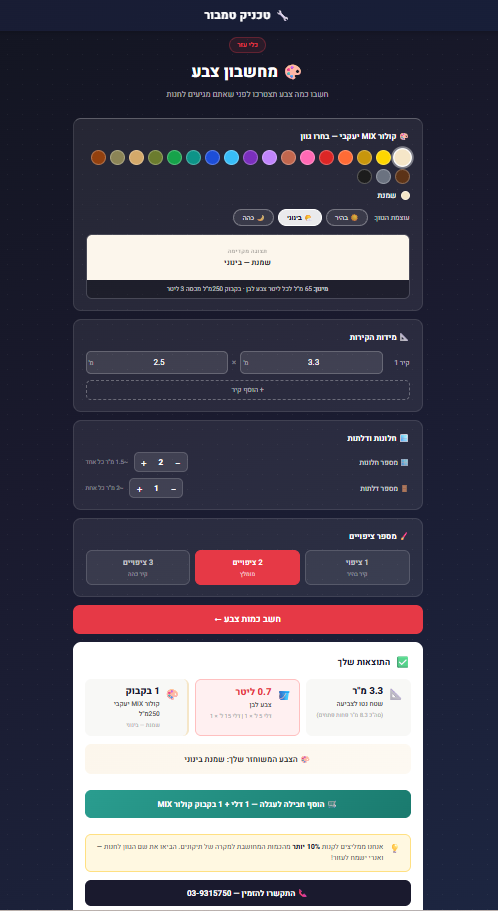
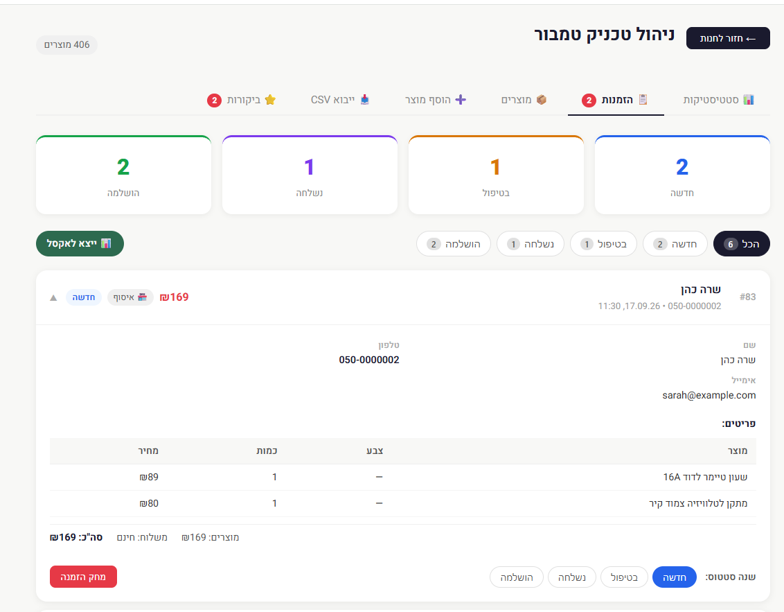
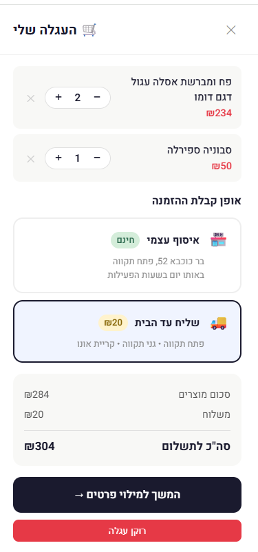
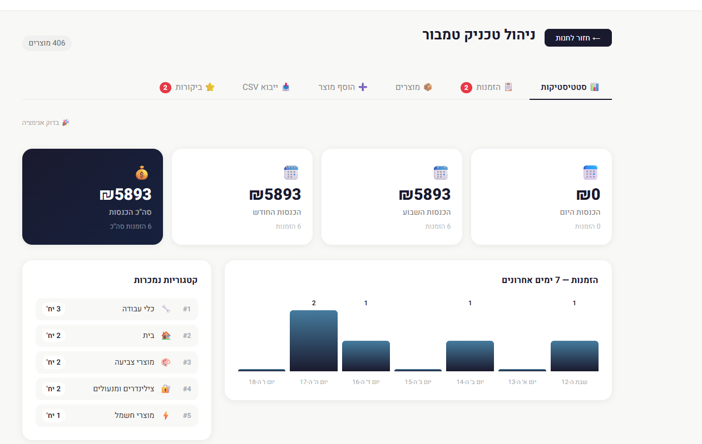
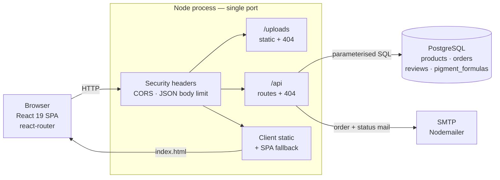

# Technik Tambour — Online Store

A full-stack e-commerce application for a hardware and building-supplies store in Petah
Tikva, Israel. It serves a catalog of 406 products across 12 categories, a cart and
checkout flow with email notifications, moderated customer reviews, and two
domain-specific calculators that turn a job into a shopping list — a paint calculator
that works out coverage and pigment quantities, and a project calculator for jobs like a
bathroom renovation. Behind it is a password-protected admin panel where the owner
manages products, orders and reviews. The storefront is Hebrew and right-to-left; the
server runs as a single Node process that serves both the API and the React app.

---

## Screenshots

Screenshots use seeded demo data, not real customer records. The site is not deployed
yet — everything below runs locally.

<table>
  <tr>
    <td colspan="2">
      <br/>
      <sub><b>Home page</b> — hero, live review rating, and the 12 product categories.</sub>
    </td>
  </tr>
  <tr>
    <td width="50%">
      <br/>
      <sub><b>Paint calculator</b> — wall area, openings and coats become litres, a pigment recipe and a one-click cart bundle.</sub>
    </td>
    <td width="50%">
      <br/>
      <sub><b>Admin — orders</b> — status breakdown, filters, CSV export, and one order expanded with its line items.</sub>
    </td>
  </tr>
  <tr>
    <td width="50%">
      <br/>
      <sub><b>Cart</b> — quantities, pickup or delivery, and a total the server recalculates on submit.</sub>
    </td>
    <td width="50%">
      <br/>
      <sub><b>Admin — statistics</b> — revenue by period, a 7-day order chart and best-selling categories.</sub>
    </td>
  </tr>
  <tr>
    <td width="50%">
      <i>Category page — coming soon</i><br/>
      <sub>Product grid with subcategory filters and per-category theming. Waiting on product photography.</sub>
    </td>
    <td width="50%">
      <i>Product page — coming soon</i><br/>
      <sub>Image gallery, stock status and product reviews. Waiting on product photography.</sub>
    </td>
  </tr>
</table>

<!--
  TO ADD THE REMAINING TWO SHOTS:
  drop docs/images/04-category-page.png and docs/images/07-product-page.png in place,
  then replace the two "coming soon" cells in the last table row above with:

    <br/>
    <sub><b>Category page</b> — ...</sub>

    <br/>
    <sub><b>Product page</b> — ...</sub>

  Nothing else in this file needs to change.
-->

---

## Features

### Storefront
- Catalog browsing by category and subcategory, with search, sorting and stock status
- Product pages with an image gallery, colour and size selection, and product reviews
- Cart persisted in `localStorage`, pickup or delivery, with a delivery-area check
- Wishlist, recently-viewed products, and order lookup by phone number
- Reviews for the store and for individual products; the home page rating is computed
  from approved reviews and hides itself when there are none
- Real URLs throughout — every page, filter and modal is linkable and survives a refresh

### Paint and project calculators
- Paint calculator: computes wall area from any number of walls, subtracts windows and
  doors, multiplies by coats, and converts to litres and containers
- 20 pigment shades stored in the database, each with millilitres-per-litre at three
  depth levels, with a live colour preview
- Project calculator: 4 job types (bathroom renovation, cylinder replacement, garden,
  and more) that expand into a checklist of the products the job needs
- Both add every product the job requires to the cart in one action

### Admin panel
- Six tabs, each with its own URL: statistics, orders, products, add/edit, CSV import,
  review moderation
- Product management with multi-image upload (up to 5 per product)
- Bulk product import from CSV, with a preview and per-row validation before committing
- Order tracking with status changes that email the customer automatically
- Review moderation — nothing is published until it is approved
- Statistics: revenue by period, a 7-day order chart, best-selling categories,
  out-of-stock list, and order export to CSV

### Email
Three templates, sent through Nodemailer: a new-order notification to the store, an
order confirmation to the customer, and an update on every status change. All
user-supplied values are HTML-escaped. `MAIL_ENABLED=false` logs instead of sending.

---

## Tech stack

| Layer | Technology |
|---|---|
| Server | Node.js, Express 5 |
| Database | PostgreSQL via `pg` — no ORM |
| Client | React 19 (Create React App) |
| Routing | react-router-dom 7 |
| Authentication | Hand-written HMAC-SHA256 session tokens in an httpOnly cookie |
| Email | Nodemailer |
| File uploads | Multer |
| Tests | Node's built-in `fetch`, no test framework |

There is no ORM and no third-party auth library. The data-access layer and the session
handling were written directly so that every query and every security decision is
visible in the repository rather than delegated to a dependency.

---

## Architecture



One process serves the API, the uploaded images and the React build from the same
origin, so there is no CORS problem in production and no second deployment target.

### Folder structure

```
server/
  config/        env loading and validation, one shared database pool
  db/            SQL migrations and the runner
  models/        all SQL lives here — explicit columns, never SELECT *
  controllers/   no SQL and no try/catch; errors bubble to one handler
  validators/    every body and query parameter checked and bounded
  routes/        one router per domain, marking what is public and what is guarded
  services/      admin authentication, email templates and transport
  middleware/    error handling, uploads, security headers, rate limiting

client/src/
  index.js       entry point — CRA requires it at exactly this path
  js/            React components, one per screen or widget
  css/           app.css imports every partial; base / layout / components / features

test/            five end-to-end suites, 237 checks
scripts/         CSV product import, demo-data seeding
docs/images/     screenshots used by this README
uploads/         admin image uploads — contents gitignored
```

### Design decisions

**Layered server.** A request goes route → validator → controller → model. SQL exists
only in models, validation only in validators, and controllers contain no `try/catch` —
errors are thrown and a single error handler converts them to responses. The result is
that "where does this belong?" almost always has one answer.

**Routing: real URLs, not component state.** The app originally tracked the current
screen in React state, which meant a single URL for the whole site — nothing was
linkable and a refresh always returned to the home page. It now uses react-router with
`/`, `/category/:slug`, `/product/:id`, `/cart`, `/checkout`, `/orders/lookup`,
`/wishlist` and `/admin/:tab`.

- **Deep links load their own data.** `/product/:id` previously received the product as
  an object from the list that rendered it, so a direct link could not work at all. The
  route now fetches the product by id, showing a skeleton while loading and a 404 for an
  unknown one.
- **Modal as route.** The cart, wishlist and order lookup are overlays. Rather than
  rebuild them as pages, the route decides whether the overlay is open — `/cart` renders
  the cart over the storefront, `/checkout` renders the same component one step further
  on. This gives them shareable URLs and makes the browser back button close them,
  without touching the existing markup. Closing steps back through history, or goes to
  `/` when the URL was opened cold.
- **Nested admin routes over query parameters.** Each admin tab is `/admin/:tab`, so a
  tab can be linked directly and browser back moves between tabs. Query parameters would
  have worked but would not have given the same history behaviour.
- **Shared state lives above the routes.** Cart and wishlist sit in a context provided
  at the app root, because `<Outlet>` does not pass props and the cart has to survive
  navigation between screens.
- **Filters that belong in the URL are in the URL.** The subcategory filter is a query
  parameter so a filtered category page can be shared. Search text and sort order stay
  local, because they change on every keystroke and would otherwise flood browser
  history.

**Middleware ordering keeps the SPA fallback honest.** The client is a single-page app,
so unknown paths must return `index.html` — otherwise a refresh on `/product/216` would
404. That catch-all is dangerous if it is reached too early, so two routes terminate
before it:

```
security headers → CORS → JSON body limit
  → /uploads   static, then 404          ← stops here, never falls through
  → /api       routes, then 404 JSON     ← stops here, never falls through
  → client static assets
  → GET *      index.html                 (the SPA fallback)
```

Without the `/uploads` terminator a missing image returned `index.html` with HTTP **200**
— a broken link that looked like a success, and which also made a test pass against a
file that did not exist. Both terminators are covered by tests so the ordering cannot be
broken silently.

**Migrations run on startup, before the port opens.** Schema changes are plain `.sql`
files applied in order and recorded in `schema_migrations`, so a fresh clone reaches a
working schema with `npm start`. Demo data is deliberately *not* part of this — the
migration runner only reads `.sql` files, so the seed script cannot be swept into
startup.

---

## Security

- **The admin password is only ever checked on the server**, with a constant-time
  comparison over SHA-256 digests so that a wrong guess takes the same time as a right
  one.
- **Sessions are hand-rolled HMAC tokens.** A token is
  `base64url(payload).base64url(HMAC-SHA256(payload))`. The algorithm is fixed in code
  and is not read from the token, so the `alg: none` class of JWT attack does not apply.
  Signatures are compared with `crypto.timingSafeEqual`.
- **The token is delivered in an `httpOnly`, `SameSite=Strict` cookie**, so page
  JavaScript cannot read it and it is not sent on cross-site requests. It is never put
  in the response body. `Secure` is set automatically in production.
- **Login is rate limited** — 10 attempts per 15 minutes per IP address, with
  `RateLimit-*` and `Retry-After` headers. A successful login resets the counter.
- **Order totals are computed server-side** from the line items. `subtotal`,
  `delivery_fee` and `total` are ignored if present in the request body, so a crafted
  request cannot set its own price. Attempting to edit `total` or `items` on an existing
  order is rejected with a 400.
- **Reviews are always stored unapproved**, and the public endpoint cannot be persuaded
  to return unapproved ones — the controller pins `approved: true` rather than trusting
  a query parameter.
- **Every query is parameterised.** No SQL string is built from user input.
- **Every input is validated and bounded** before it reaches the database — types,
  lengths, enums, and numeric ranges.
- **Uploads are restricted** to an allowlist of image extensions *and* an `image/*`
  content type, capped at 8 MB and 5 files, and stored under a randomised filename so a
  crafted name cannot overwrite anything.
- **User-supplied values in emails are HTML-escaped.**
- **Security headers on every response:** `X-Content-Type-Options: nosniff`,
  `X-Frame-Options: DENY`, `Referrer-Policy`, `Permissions-Policy`, and HSTS in
  production. `X-Powered-By` is disabled. CORS is open in development and restricted to
  configured origins in production.

A Content Security Policy is written and ready but **off by default**: the built
`index.html` contains an `application/ld+json` block for structured data, which browsers
block under `script-src 'self'`. The cost of enabling it is SEO metadata, not
functionality. Turn it on with `CSP_ENABLED=true`.

---

## Testing

```bash
npm test
```

**237 checks across five suites**, all passing. The suites start their own server on port
3100, so they can run while the real server is serving on 3000. They talk to the real
database, create temporary records and delete them afterwards, then assert that nothing
was left behind.

| Suite | Checks | Covers |
|---|---|---|
| `smoke-static` | 44 | Client serving, cache headers, security headers, that client routes fall back to `index.html`, that `/api` and `/uploads` do **not**, and that no internal file is exposed |
| `smoke-orders` | 43 | Order lifecycle, server-side total calculation, status transitions, pagination and filtering, immutable fields |
| `smoke-reviews` | 57 | Moderation, the split between public and admin listings, and the stats contract the home page depends on |
| `smoke-pigments` | 48 | The 20 shades, ordering, search, and that existing data is left untouched |
| `smoke-auth` | 45 | Login, cookie flags, route protection, logout, and rate limiting |

Two details worth calling out, because both were bugs the tests originally hid:

- The review statistics checks measure a **before/after delta** rather than absolute
  numbers. They used to assert `total === 2`, which only passed because the table
  happened to be empty — the store's first real review would have broken the suite.
- The upload check picks a file **from disk** rather than from a product's `image_url`.
  It previously asserted that an image was served while the server was actually
  returning `index.html` for a file that did not exist.

---

## Getting started

**Requirements:** Node.js 18 or newer, PostgreSQL with a database named `tamburia`.

```bash
git clone https://github.com/idand2459-dot/tamburia-store.git
cd tamburia-store

npm install
npm install --prefix client

cp .env.example .env        # then fill in the values below
npm run build:client
npm start
```

The store comes up at **http://localhost:3000** and the admin panel at **/admin**.
Migrations run automatically on startup, before the port opens.

### Environment variables

The full list with comments is in [`.env.example`](.env.example). The ones you must set:

| Variable | Default | Description |
|---|---|---|
| `DB_PASSWORD` | — | **Required.** PostgreSQL password |
| `ADMIN_PASSWORD` | — | **Required.** Admin panel password |
| `SESSION_SECRET` | — | Token signing secret. **Required in production** |
| `MAIL_USER` / `MAIL_PASS` | — | Gmail account used to send mail |
| `MAIL_ENABLED` | `true` | `false` logs emails instead of sending them |
| `PORT` | `3000` | Server port |
| `DELIVERY_FEE` | `20` | Delivery fee, in shekels |
| `CSP_ENABLED` | `false` | Content Security Policy — see the note above |

Generate a session secret with:

```bash
node -e "console.log(require('crypto').randomBytes(32).toString('hex'))"
```

### Commands

| Command | What it does |
|---|---|
| `npm start` | Runs the server on port 3000 |
| `npm test` | Runs all five test suites |
| `npm run build:client` | Builds the React app |
| `npm run dev:client` | React dev server with hot reload |
| `npm run migrate` | Runs migrations without starting the server |
| `npm run seed:demo` | Inserts demo orders and reviews |
| `npm run seed:demo:clear` | Removes exactly that demo data again |

### Demo data

A fresh install has products but no orders or reviews, which leaves the admin dashboard
and the review sections empty. To fill them:

```bash
npm run seed:demo
```

This inserts 6 orders spread across all four statuses and dated over the last week, plus
7 reviews — 5 approved and 2 awaiting moderation. Line items are built from real products
in your database. It prints every ID it creates and records them in
`scripts/.seed-demo-manifest.json`.

```bash
npm run seed:demo:clear
```

Removes the demo rows **by those exact IDs**, so the database can be handed over clean
before the store goes live. If the manifest is missing it falls back to matching the
demo markers — orders use phone numbers in the unallocated `050-000000x` block, and
reviews are matched on their exact name and text. Re-running the seed replaces its own
rows rather than duplicating them.

Demo data is separate from the migrations and never runs automatically.

### Client development

For hot reload, run the server and the React dev server side by side. React must be
given a different port or it will collide with the API:

```bash
npm start                                    # server, port 3000
$env:PORT=3001; npm start --prefix client    # React, port 3001
```

> `client/build` is not committed. After any change under `client/src`, run
> `npm run build:client` or the browser at port 3000 will keep serving the previous
> version.

---

## API

Everything is under `/api`. Routes marked 🔒 require an admin session.

| Domain | Routes |
|---|---|
| **Auth** | `POST /auth/login` · `POST /auth/logout` · 🔒 `GET /auth/me` |
| **Products** | `GET /products` · `GET /products/:id` · `GET /products/categories` · 🔒 `POST` `PUT /:id` `DELETE /:id` |
| **Orders** | `POST /orders` · `GET /orders/by-phone/:phone` · 🔒 `GET /orders` `GET /:id` `GET /stats` `PUT /:id` `PUT /:id/status` `DELETE /:id` |
| **Reviews** | `GET /reviews` · `GET /reviews/stats` · `POST /reviews` · 🔒 `GET /reviews/all` `GET /:id` `PUT /:id` `PUT /:id/approve` `DELETE /:id` |
| **Pigment formulas** | `GET /pigment-formulas` · `GET /pigment-formulas/:id` · `GET /pigment-formulas/code/:code` · 🔒 `POST` `PUT /:id` `DELETE /:id` |
| **Uploads** | 🔒 `POST /upload` · 🔒 `POST /upload-multiple` |
| **Health** | `GET /health` |

List endpoints accept `limit`, `offset`, `sort`, `order` and per-domain filters. Without
`limit` or `offset` they return a flat array; with them, an object carrying pagination.

---

## Status and known issues

This is a working application running locally against a real database. It is **not
deployed** — there is no public URL yet, and the screenshots above use seeded demo data
rather than real orders or customers.

Known gaps, in rough order of how much they matter:

1. **Most products have no photographs.** 192 of 193 image references in the catalog
   point at files that were never uploaded, left over from the CSV import. Product cards
   fall back to a letter placeholder, which looks deliberate but is not. Photography is
   in progress; this is also why two screenshot slots above are still empty.
2. **About a quarter of the catalog has no price.** 124 of 406 products have `price = 0`
   and currently render as `₪0`. They should display
   **"לפרטים ומחיר צרו קשר"** instead, and be excluded from price sorting.
3. **Product validation uses native `alert()`** for "choose a colour / size / variant
   first" ([ProductPage.js](client/src/js/ProductPage.js)). This should become inline
   validation next to the field.
4. **The `kitchen` category is defined but empty** — it appears on the home page and
   leads to a category page with no products.
5. **Rate limiting is in-process.** Counters live in the Node process's memory, which is
   correct for a single server but would not hold behind more than one instance.
6. **`DB_LOG_QUERIES` is undocumented** in `.env.example`. It defaults to on outside
   production, which is why development logs every query.
7. **No automated frontend tests.** The 237 checks are end-to-end against the HTTP API;
   React components are covered only by manual testing.

The three remaining figures in the home page hero — 400+ products, 12 categories, 30+
years — are hardcoded and currently accurate. The rating beside them is not: it is
computed from approved reviews and disappears when there are none.
