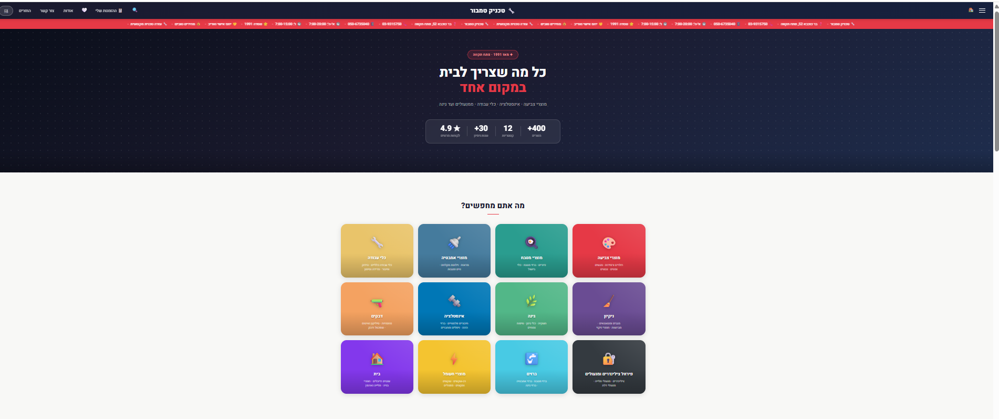
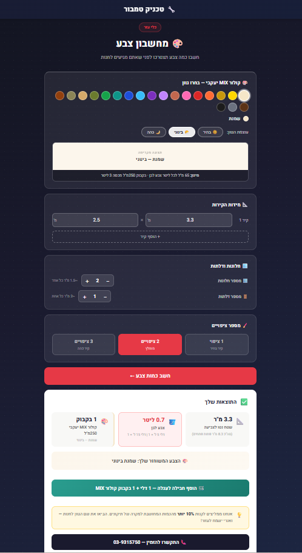
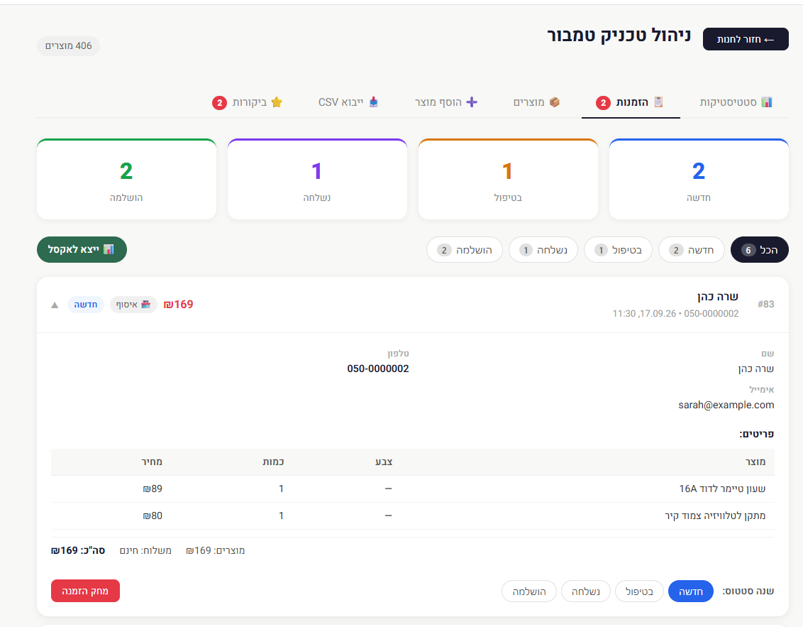
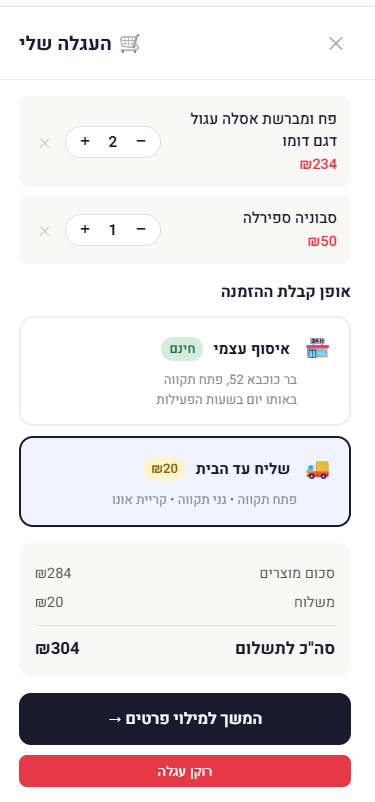
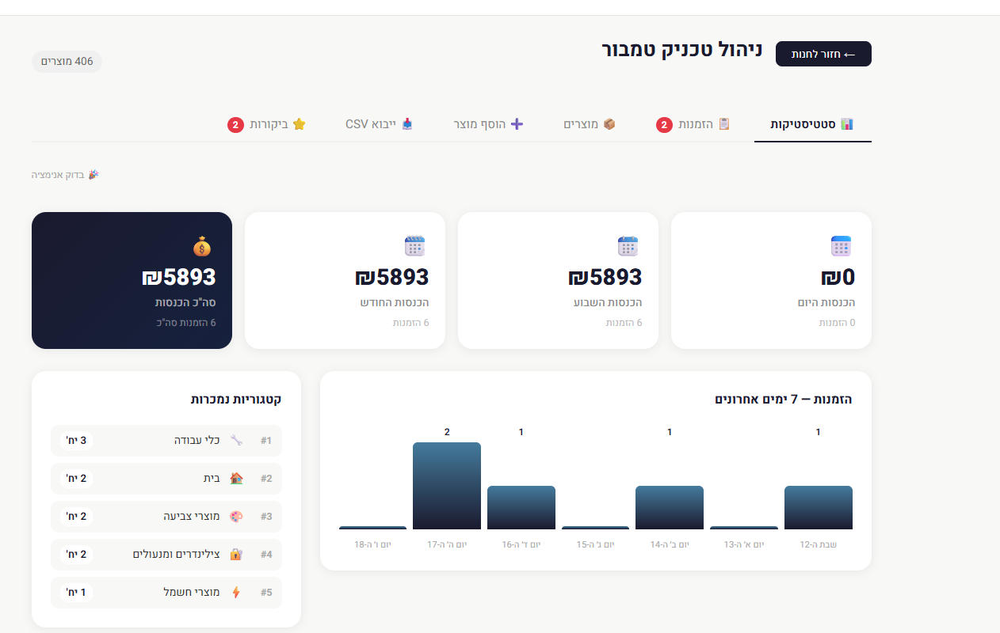
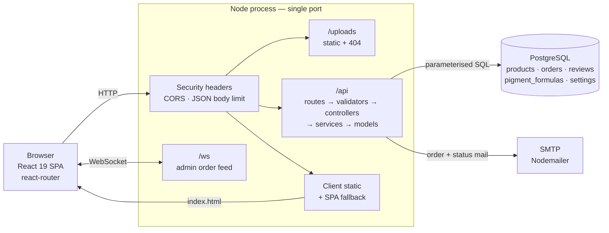

# Technik Tambour — Online Store

A full-stack e-commerce application for a hardware and building-supplies store in Petah
Tikva, Israel: a catalogue of about 400 products in 12 categories, a cart and checkout flow
with email notifications, moderated customer reviews, and two calculators that turn a job
into a shopping list. A paint calculator works out coverage and pigment quantities, and a
project calculator handles jobs like a bathroom renovation. Behind it is a password-protected
admin panel where the owner manages products, orders and reviews, with a live feed of new
orders. The storefront is Hebrew and right-to-left, and meets IS 5568 / WCAG 2.1 AA. One
Node process serves both the API and the React app.

**How it is built, and why:** [docs/ARCHITECTURE.md](docs/ARCHITECTURE.md). It covers the
layers, a request traced from a click to the database and back, and the design decisions.

---

## Screenshots

Screenshots use seeded demo data, not real customer records. The site is not deployed
yet; everything below runs locally.

<table>
  <tr>
    <td colspan="2">
      <br/>
      <sub><b>Home page</b> — hero, live review rating, and the 12 product categories.</sub>
    </td>
  </tr>
  <tr>
    <td width="50%">
      <br/>
      <sub><b>Paint calculator</b> — wall area, openings and coats become litres, a pigment recipe and a one-click cart bundle.</sub>
    </td>
    <td width="50%">
      <br/>
      <sub><b>Admin — orders</b> — status breakdown, filters, CSV export, and one order expanded with its line items.</sub>
    </td>
  </tr>
  <tr>
    <td width="50%">
      <br/>
      <sub><b>Cart</b> — quantities, pickup or delivery, and a total the server recalculates on submit.</sub>
    </td>
    <td width="50%">
      <br/>
      <sub><b>Admin — statistics</b> — revenue by period, a 7-day order chart and best-selling categories.</sub>
    </td>
  </tr>
</table>

---

## Features

### Storefront
- Catalogue browsing by category and subcategory, with search, sorting and stock status
- Product pages with an image gallery, colour, size and variant selection, and product reviews
- Cart persisted in `localStorage`, pickup or delivery, with a delivery-area check
- Wishlist, recently viewed products, and order lookup by phone number
- Reviews for the store and for individual products. The home page rating is computed
  from approved reviews and hides itself when there are none
- Real URLs throughout: every page, filter and modal is linkable and survives a refresh
- An accessibility statement at `/accessibility`

### Paint and project calculators
- Paint calculator: wall area from any number of walls, minus windows and doors, times
  coats, converted to litres and containers
- 20 pigment shades stored in the database, each with millilitres per litre at three
  depths, with a live colour preview
- Project calculator: four job types that expand into a checklist of the products the job needs
- Both add every product the job requires to the cart in one action

### Admin panel
- Six tabs, each with its own URL: statistics, orders, products, add/edit, CSV import,
  review moderation
- A live order feed over WebSocket, with a chime for each new order
- Product management with multi-image upload (up to 5 per product); every image is
  squared, resized and saved as content-hashed WebP
- Hide instead of delete: products with orders are taken off the shelf, not out of the database
- Bulk product import from CSV, with a preview and per-row validation before committing
- Order tracking with status changes that email the customer automatically
- Review moderation: nothing is published until it is approved
- Lazy-loaded: shoppers never download the admin code

### Email
Three templates, sent through Nodemailer: a new-order notification to the store, an
order confirmation to the customer, and an update on every status change. All
user-supplied values are HTML-escaped. `MAIL_ENABLED=false` logs instead of sending.

---

## Tech stack

| Layer | Technology |
|---|---|
| Server | Node.js ≥ 18, Express 5 |
| Database | PostgreSQL via `pg`, no ORM |
| Client | React 19 (Create React App), react-router 7 |
| Real time | `ws` (admin order feed) |
| Images | Multer for uploads, sharp for processing |
| Authentication | Hand-written HMAC-SHA256 session tokens in an httpOnly cookie |
| Email | Nodemailer |
| Tests | Server: plain Node scripts against a real server and database. Client: Jest + Testing Library. Accessibility: axe-core via Puppeteer |

There is no ORM and no third-party auth library. The data-access layer and the session
handling were written directly, so every query and every security decision is visible in
the repository rather than delegated to a dependency.

---

## Architecture


```mermaid
flowchart LR
    B["Browser<br/>React 19 SPA<br/>react-router"]

    subgraph S["Node process — single port"]
        H["Security headers<br/>CORS · JSON body limit"]
        U["/uploads<br/>static + 404"]
        A["/api<br/>routes → validators → controllers<br/>→ services → models"]
        W["/ws<br/>admin order feed"]
        C["Client static<br/>+ SPA fallback"]
    end

    DB[("PostgreSQL<br/>products · orders · reviews<br/>pigment_formulas · settings")]
    M["SMTP<br/>Nodemailer"]

    B -->|"HTTP"| H
    H --> U
    H --> A
    H --> C
    B <-->|"WebSocket"| W
    A -->|"parameterised SQL"| DB
    A -->|"order + status mail"| M
    C -->|"index.html"| B
```

One process serves the API, the uploaded images and the React build from the same
origin, so there is no CORS setup in production and no second deployment target.

### Folder structure

```
server/
  config/        env loading and validation, the one shared database pool
  db/            SQL migrations (000–010) and the runner
  routes/        one router per domain, marking what is public and what is guarded
  validators/    every body and query parameter checked and bounded
  controllers/   HTTP in, service call, HTTP out — no SQL, no models, no try/catch
  services/      business rules: pricing, visibility, moderation, email, realtime, auth, images
  models/        all SQL lives here — explicit columns, never SELECT *
  middleware/    error handling, uploads, security headers, admin guard, rate limiting
  utils/         errors, money in agorot, the pagination envelope, the category tree

client/src/
  index.js       entry point — CRA requires it at exactly this path
  css/           app.css imports every partial: base / layout / components / features
  js/pages/      route screens (and pages/admin/, the admin screen and its tabs)
  js/components/ reusable UI
  js/features/   feature UI by domain: home, catalog, cart, calculators
  js/hooks/      state and effects (cart, checkout, availability, admin data)
  js/services/   every server call the storefront makes
  js/utils/      pure helpers (pricing, store info, palette, icons)

test/            15 server suites, 646 checks
scripts/         catalogue import, demo data, the product-photo pipeline, the a11y audit
docs/            ARCHITECTURE.md, the product-photo runbook, the accessibility audit, screenshots
photos/          raw phone photos in, processed store images out — contents gitignored
uploads/         admin image uploads — contents gitignored
```

The full map, one line per folder, is in [docs/ARCHITECTURE.md](docs/ARCHITECTURE.md).

### Design decisions

**Layered server, the same in every domain.** A request goes route → validator →
controller → service → model. SQL exists only in models, validation only in validators,
business rules only in services, and controllers contain no `try/catch`. Errors are thrown
as `AppError` and a single error handler turns them into responses. "Where does this
belong?" almost always has one answer.

**Prices come from the server.** The order total is computed from the database, never from
the request: the price the customer saw is compared, and a change returns 409 with the
current prices so the cart can correct itself. Money is integer agorot in code and
`NUMERIC(10,2)` in the database. See the worked example in
[ARCHITECTURE.md](docs/ARCHITECTURE.md#a-request-end-to-end-placing-an-order).

**Routing: real URLs, not component state.** react-router with `/`, `/category/:slug`,
`/product/:id`, `/about`, `/contact`, `/returns`, `/accessibility`, `/cart`, `/checkout`,
`/orders/lookup`, `/wishlist` and `/admin/:tab`.

- **Deep links load their own data.** `/product/:id` fetches the product by id, showing a
  skeleton while loading and a 404 for an unknown one.
- **Modal as route.** The cart, wishlist and order lookup are overlays whose open state
  is the URL. `/cart` renders the cart over the storefront, and `/checkout` renders the
  same drawer one step further on. They get shareable URLs, and the browser back button
  closes them.
- **Nested admin routes over query parameters.** Each admin tab is `/admin/:tab`, so a
  tab can be linked directly and back moves between tabs.
- **Shared state lives above the routes.** Cart, wishlist and checkout sit in a context
  provided at the app root, because the cart has to survive navigation between screens.
- **Filters that belong in the URL are in the URL.** The subcategory filter is a query
  parameter so a filtered page can be shared. Search text and sort order stay local,
  because they change on every keystroke and would flood the history.

**Middleware ordering keeps the SPA fallback honest.** Unknown paths must return
`index.html` (otherwise a refresh on `/product/216` would 404), but that catch-all is
dangerous if reached too early, so two routes terminate before it:

```
security headers → CORS → JSON body limit
  → /uploads   static, then 404          ← stops here, never falls through
  → /api       routes, then 404 JSON     ← stops here, never falls through
  → client static assets
  → GET *      index.html                 (the SPA fallback)
```

Without the `/uploads` terminator a missing image returned `index.html` with HTTP **200**,
a broken link that looked like a success. Both terminators are covered by tests.

**Migrations run on startup, before the port opens.** Schema changes are plain `.sql`
files applied in order and recorded in `schema_migrations`. Migration `000` creates the
`products` table that the early migrations assume, so a fresh database reaches the full
schema. `smoke-fresh-db` proves it on every test run. Demo data is deliberately *not* part
of this: the runner only reads `.sql` files.

**Hide instead of delete.** `products.active` is how a product leaves the shop without
leaving the database, because orders, reviews and the calculators reference products by id.
A hidden product does not exist for a customer: it's absent from lists, search and
category counts, and `GET /api/products/:id` returns the same 404 as an id that never
existed. An admin sees hidden products only when asking for them (`?active=all|false`),
except by id, so the edit form can restore one. The rule lives in `product.service`, and
checkout rejects hidden products again. A product that has orders cannot be deleted
(409); the admin is offered "hide" instead.

**Content-hashed images, long cache.** Every uploaded image is named after a hash of its
processed bytes, so a changed image is a new URL. `/uploads` is cached for a week and
`/static` for a year as `immutable`, while `index.html` is never cached.

**The admin is lazy-loaded.** `React.lazy` + `Suspense` on `/admin/:tab`: the main bundle
went from 149.25 kB to 132.13 kB (gzipped), and the admin is a separate 21.1 kB chunk.

**CSS: ITCSS, one component per partial.** `client/src/css/app.css` imports
`base → layout → components → features/<domain>`, and its import order is the cascade.
The rules are in [client/src/css/CONVENTIONS.md](client/src/css/CONVENTIONS.md).

---

## Security

- **The admin password is only ever checked on the server**, with a constant-time
  comparison over SHA-256 digests.
- **Sessions are hand-rolled HMAC tokens:** `base64url(payload).base64url(HMAC-SHA256(payload))`.
  The algorithm is fixed in code and not read from the token, so the `alg: none` class of
  JWT attack does not apply. Signatures are compared with `crypto.timingSafeEqual`.
- **The token is delivered in an `httpOnly`, `SameSite=Strict` cookie**, never in the
  response body. `Secure` is set automatically in production.
- **Production refuses weak configuration.** The server will not start in production
  without `SESSION_SECRET`, or with an `ADMIN_PASSWORD` shorter than 12 characters. The
  error names the variable, never its value.
- **Secrets live only in the environment.** `.env` is gitignored, `.env.example` holds
  placeholders only, and `test/unit-repo-hygiene.js` fails the suite if `.env` is tracked
  or any secret value from it appears in a tracked file.
- **Login and order lookup are rate limited.** Login allows 10 attempts per 15 minutes per IP,
  with `RateLimit-*` and `Retry-After` headers, and a successful login resets the counter.
- **Order totals are computed server-side**; see Design decisions. Editing `total` or
  `items` on an existing order is rejected with a 400.
- **Reviews are always stored unapproved**, and the public endpoints always return approved
  reviews only, whatever the query asks.
- **Every query is parameterised**, and **every input is validated and bounded**.
- **Uploads are restricted** to an allowlist of image types, capped at 8 MB and 5 files,
  re-encoded (which strips metadata, GPS included) and stored under a content hash.
- **User-supplied values in emails are HTML-escaped.**
- **Security headers on every response:** `X-Content-Type-Options: nosniff`,
  `X-Frame-Options: DENY`, `Referrer-Policy`, `Permissions-Policy`, and HSTS in
  production. `X-Powered-By` is disabled. CORS is open in development and restricted to
  configured origins in production.

A Content Security Policy is written and ready but **off by default**. The built
`index.html` contains an `application/ld+json` block for structured data, which browsers
block under `script-src 'self'`, so enabling it costs SEO metadata, not functionality.
Turn it on with `CSP_ENABLED=true`.

---

## Accessibility

The storefront targets **IS 5568 / WCAG 2.1 AA**. `npm run a11y` audits 12 pages at
desktop, mobile and dark-mode settings with axe-core, plus heading-structure, language,
skip-link and zoom-reflow checks, and must report zero findings. The audit and its fixes are
written up in [docs/a11y-audit.md](docs/a11y-audit.md); the public statement is at
`/accessibility`. There is no third-party accessibility overlay.

---

## Testing

```bash
npm test               # server: 15 suites, 646 checks
npm run test:client    # client: 9 suites, 67 tests
npm run a11y           # accessibility: serves client/build, so run npm run build:client first
```

The server suites start their own server on port 3100, so they can run while the real
server is on 3000. They talk to the real database, create temporary records and delete them
afterwards.

| Suite | Checks | Covers |
|---|---|---|
| `unit-repo-hygiene` | 6 | `.env` not tracked, `.env.example` placeholders only, no secret value in any tracked file |
| `unit-config` | 8 | The production startup rules (session secret, password length) and optional mail credentials |
| `unit-order-service` | 46 | Order business rules, without network or database |
| `unit-product-service` | 14 | Hidden-product visibility for customers and admins, with a fake model |
| `unit-review-service` | 13 | Moderation: public reads approved-only, new reviews unapproved |
| `unit-money` | 23 | Agorot arithmetic and price parsing |
| `unit-originals` | 14 | Keeping and finding the full-resolution original of an upload |
| `smoke-fresh-db` | 13 | An empty database: every migration, the catalogue import, and a column-by-column schema match with the real one |
| `smoke-static` | 47 | Client serving, cache and security headers, SPA fallback and its boundaries, no internal file exposed, the admin kept out of the main bundle |
| `smoke-orders` | 122 | Order lifecycle, server-side pricing and totals, 409 on changed prices, status transitions, pagination, immutable fields |
| `smoke-products` | 168 | CRUD, partial updates, subcategories, hiding, delete with and without orders, image cleanup |
| `smoke-settings` | 21 | The closed list of settings keys, set, reset |
| `smoke-reviews` | 57 | Moderation, the public/admin split, the stats contract the home page depends on |
| `smoke-pigments` | 48 | The 20 shades, ordering, search, the light < medium < dark invariant |
| `smoke-auth` | 46 | Login, cookie flags, every guarded route, logout, rate limiting |

---

## Getting started

**Requirements:** Node.js 18 or newer, and PostgreSQL with an empty database named `tamburia`.
`npm run a11y` also needs Chrome or Edge installed.

```bash
git clone https://github.com/idand2459-dot/tamburia-store.git
cd tamburia-store

npm install
npm install --prefix client

cp .env.example .env        # set DB_PASSWORD and ADMIN_PASSWORD (see below)
npm run migrate             # creates the schema (npm start also does this)
npm run products:import     # loads the catalogue from scripts/products_import_template.csv
npm run build:client
npm start
```

The store comes up at **http://localhost:3000** and the admin panel at **/admin**.
Imported products point at photo files that are not in the repository, so they show their
category icon until real photos are added (see [docs/product-photos.md](docs/product-photos.md)).

### Environment variables

The full list with comments is in [`.env.example`](.env.example). The ones that matter:

| Variable | Default | Description |
|---|---|---|
| `DB_PASSWORD` | — | **Required.** PostgreSQL password |
| `ADMIN_PASSWORD` | — | **Required.** Admin panel password; at least 12 characters in production |
| `SESSION_SECRET` | random per start | Token signing secret. **Required in production** |
| `MAIL_ENABLED` | `true` (`.env.example`: `false`) | `false` logs emails instead of sending them |
| `MAIL_USER` / `MAIL_PASS` | — | Gmail account and app password; required only when mail is enabled |
| `PORT` | `3000` | Server port |
| `DELIVERY_FEE` | `20` | Delivery fee in shekels (must match `client/src/js/hooks/useCart.js`) |
| `CSP_ENABLED` | `false` | Content Security Policy (see Security) |

Generate a session secret with:

```bash
node -e "console.log(require('crypto').randomBytes(32).toString('hex'))"
```

### Commands

| Command | What it does |
|---|---|
| `npm start` | Runs migrations, then the server on port 3000 |
| `npm run migrate` | Runs migrations without starting the server |
| `npm run build:client` | Builds the React app into `client/build` |
| `npm run dev:client` | React dev server with hot reload on port 3001, API proxied to 3000 |
| `npm test` | Server test suites |
| `npm run test:client` | Client tests (Jest) |
| `npm run a11y` | Accessibility audit (`-- --report` writes `docs/a11y-report.md`) |
| `npm run products:import` | Imports or merges the catalogue from a CSV (default: `scripts/products_import_template.csv`) |
| `npm run seed:demo` | Inserts demo orders and reviews |
| `npm run seed:demo:clear` | Removes exactly that demo data again |
| `npm run images:categories` | Converts the category banner PNGs in `design-assets/` to WebP |
| `npm run products:list` | Writes the printable shooting list (CSV + A4 HTML) |
| `npm run images:products` | Turns raw product photos into 1200×1200 white-background WebP |
| `npm run products:hide-unphotographed` | Lists (and with `--apply`, hides) products that were not photographed |
| `npm run products:new-template` | Writes the Excel sheet for products photographed but not in the catalogue |
| `npm run products:import-new` | Validates (and with `--apply`, creates) the products from that sheet |

The last four are the shooting-day pipeline, documented step by step in
[docs/product-photos.md](docs/product-photos.md).

### Demo data

A fresh install has products but no orders or reviews, which leaves the admin dashboard
and the review sections empty. To fill them:

```bash
npm run seed:demo
```

This inserts 6 orders across every status, dated over the last week, plus 7 reviews
(5 approved, 2 awaiting moderation). Line items are built from real products in your
database. Every created id is printed and recorded in `scripts/.seed-demo-manifest.json`.

```bash
npm run seed:demo:clear
```

Removes the demo rows **by those exact ids**, so the database can be handed over clean.
Without the manifest it falls back to the demo markers: orders use phone numbers in the
unallocated `050-000000x` block, and reviews match on their exact name and text.

### Client development

```bash
npm start              # server, port 3000
npm run dev:client     # React with hot reload, port 3001 (set in client/.env.development)
```

> `client/build` is not committed. After any change under `client/src`, run
> `npm run build:client`, or the server at port 3000 keeps serving the previous version.

---

## API

Everything is under `/api`. Routes marked 🔒 require an admin session.

| Domain | Routes |
|---|---|
| **Auth** | `POST /auth/login` · `POST /auth/logout` · 🔒 `GET /auth/me` |
| **Products** | `GET /products` · `GET /products/:id` · `GET /products/categories` · 🔒 `POST` `PUT /:id` `DELETE /:id` |
| **Orders** | `POST /orders` · `GET /orders/by-phone/:phone` · 🔒 `GET /orders` `GET /:id` `GET /stats` `PUT /:id` `PUT /:id/status` `DELETE /:id` |
| **Reviews** | `GET /reviews` · `GET /reviews/stats` · `POST /reviews` · 🔒 `GET /reviews/all` `GET /:id` `PUT /:id` `PUT /:id/approve` `DELETE /:id` |
| **Pigment formulas** | `GET /pigment-formulas` · `GET /pigment-formulas/:id` · `GET /pigment-formulas/code/:code` · 🔒 `POST` `PUT /:id` `DELETE /:id` |
| **Settings** | 🔒 `GET /settings/:key` · 🔒 `PUT /settings/:key` |
| **Uploads** | 🔒 `POST /upload-multiple` |
| **Health** | `GET /health` |

List endpoints accept `limit`, `offset`, `sort`, `order` and per-domain filters. Without
`limit` or `offset` they return a flat array; with them, an object carrying pagination.

Some endpoints are part of the API but have no screen yet: `GET /orders/stats`,
`GET /products/categories`, single-record `GET`/`PUT` for orders and reviews, and pigment
formula editing. All of them are tested.

`:key` in **Settings** is not free-form: the server knows a closed list of keys and
returns 404 for anything else. Today there is one, `stats-counting-from`: the date the
statistics tab counts its sums from. `PUT` with `value: null` deletes it, which undoes a reset.

---

## Status and known issues

This is a working application running locally against a real database. It is **not
deployed** yet, and the screenshots use seeded demo data.

Known gaps, in rough order of how much they matter:

1. **Not every product has a photograph yet.** About a third of the active catalogue has
   real photos from the shoot; the rest show their category icon.
2. **Unpriced products.** About 90 active products have no price yet. They show
   **"מחיר בחנות"** and cannot be added to the cart, but they still sort first under
   "price, low to high".
3. **The `kitchen` category is defined but has no active products.** It appears on the home
   page and leads to an empty category page.
4. **Rate limiting is in-process.** Counters live in the Node process's memory, which is
   correct for a single server but would not hold behind more than one instance.

The figures in the home page hero (400+ products, 12 categories, 30+ years) are hardcoded.
The rating beside them is computed from approved reviews and disappears when there are none.
